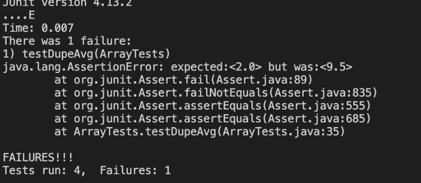

# Lab Report 2 - Servers and Bugs

## Part 1 - Write a web server called StringServer
* StringServer

```
import java.io.IOException;
import java.net.URI;
class Handler implements URLHandler {
    String a;
    public String handleRequest(URI url) {
        if (url.getPath().contains("/add-message")) {
            String[] parameters = url.getQuery().split("=");
            String tt;
            if (a != null) {
                tt = a + "\n" + parameters[1];
                return tt;
            }
            a = parameters[1];
            return a;
        }
        return "404 Not Found!";
    }
    class StringServer {
        public static void main(String[] args) throws IOException {
            if(args.length == 0){
                System.out.println("Missing port number! Try any number between 1024 to 49151");
                return;
            }
    
            int port = Integer.parseInt(args[0]);
    
            Server.start(port, new Handler());
        }
    }
 ```
* After the code, you run it in the terminal
* Open terminal on VScode with *Ctrl* + *~*  
* In terminal type 
  * `javac Server.java StringServer.java`
  * `java StringServer 4000`
* type the link into a search browser
* it will output "404 Not Found!"

* This is because there is no message given in the link
  * To fix this add `/add-message?=<string>`
  * string can be anything
  * for example `/add-message?=Hello`
  * "Hello" should be the output 

* 'handleRequest' method is called and executes the first two if statements successfully.
* returns the message "Hello"
* If URL path contains /add-message, the query string is split using "=" and stored in parameters array.
* The relevant fields to the method are a, parameters, and tt.
* If a is not null, tt is assigned the concatenated value of a and parameters[1].
* a is updated to parameters[1], and the method returns the updated value of tt or a.
* If URL path does not contain /add-message, the method returns "404 Not Found!".
* When "Hello" is replaced with "How are you", both messages are printed on the same link.
* "How are you" is printed below "Hello" due to newline character \n.
  *In adding "How are you", a is updated to parameters[1], and the method returns the updated value of a or tt.


*The handleRequest method is called again and passes the first two if statements successfully.
  * The newline character \n caused the return of "How are you" in a new line.
  * When "How are you" was added, the value in the link changed.
  * The %20 in between "How", "are", and "you" indicates the spaces.
  
 ## Part 2 - Choosing a bug from Lab 3
*  failure-inducing input 
```
  public void testReversed() {
    int[] input1 = { };
    assertArrayEquals(new int[]{1,2,3 }, ArrayExamples.reversed(input1));
  }
```
* Input not inducing a failure
```
public void testReversed2() {
    int[] input1 = { 4, 3, 2, 1};
    assertArrayEquals(new int[]{1, 2, 3, 4}, ArrayExamples.reversed(input1));
  }
  ```
* Output of running test cases

* Before 
```
static int[] reversed(int[] arr) {
    int[] newArray = new int[arr.length];
    for(int i = 0; i < arr.length; i += 1) {
      arr[i] = newArray[arr.length - i - 1];
    }
    return arr;
  }
  ```
* After 
  ```
  static int[] reversed(int[] arr) {
    int[] newArray = new int[arr.length];
    for(int i = 0; i < arr.length; i += 1) {
      newArray[i] = arr[arr.length - i - 1];
    }
    return newArray;
  }
  ```
 * why this fixes the issue:
  
 * The issue was fixed by changing arr[i] to newArray[i] = arr[arr.length - i -1] in the for loop.
  
 * The new solution worked because newArray had no elements, and arr was being filled up with empty elements.
 
 * To return the new array value, we had to change arr to newArray.
 
 * The solution fills up newArray with elements from arr in reverse order (from last to first).

## Part 3 - What didn't know before
* I was not confident in my ability to make a web server but ater putting the time, I think my skills got better overall.

